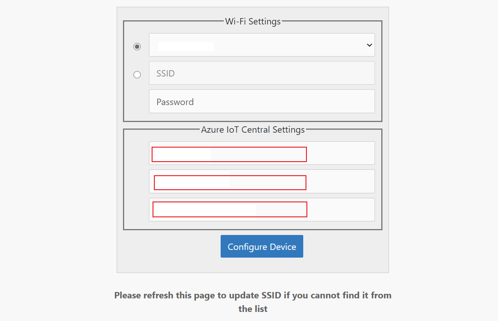
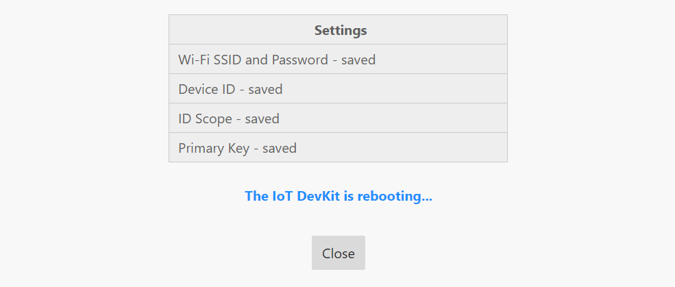
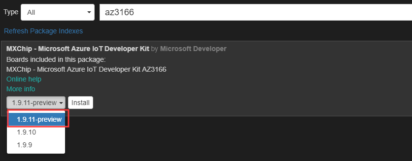

## Connect an MXChip IoT DevKit device to your Azure IoT Central application

This article shows you how to connect an MXChip IoT DevKit (DevKit) device to an Azure IoT Central application. The device uses the certified IoT Plug and Play model for the DevKit device to configure its connection to IoT Central.

In this how-to article, you:

- Get the connection details from your IoT Central application.
- Prepare the device and connect it to your IoT Central application.
- View the telemetry and properties from the device in IoT Central.

## Prerequisites

To complete the steps in this article, you need the following resources:

1. A [DevKit device](https://aka.ms/iot-devkit-purchase).
1. An IoT Central application created from the **Preview application** template. You can follow the steps in [Create an IoT Plug and Play application](https://docs.microsoft.com/en-us/azure/iot-central/quick-deploy-iot-central-pnp?toc=/azure/iot-central-pnp/toc.json&bc=/azure/iot-central-pnp/breadcrumb/toc.json).

## Get device connection details

1. In your Azure IoT Central application, select the **Device Templates** tab and select **New**. In the section of **Use a preconfigured device template**, choose **MXChip IoT DevKit** from the list. And choose **Next: Customize** and **Create**.

    

1. Select **Devices** tab, in the devices list, select **MXChip IoT DevKit** and select **New** to create a new device from Device Template.

    

1. In the pop-up window, enter the **Device ID** as `SampleDevKit` and **Device Name** as `MXChip IoT DevKit - Sample`. Ensure **Simulated** option is off. Then select **Create**.

    

1. Click the device you just created and select **Connect**. Make a note of the **ID Scope**, **Device ID** and **Primary key**.

    

## Prepare the device

1. Download the latest [pre-built Azure IoT Central Plug and Play firmware](https://aka.ms/devkit/prod/iotcentral/latest) for the DevKit device from GitHub.

1. Connect the DevKit device to your development machine using a USB cable. In Windows, a file explorer window opens on a drive mapped to the storage on the DevKit device. For example, the drive might be called **AZ3166 (D:)**.

1. Drag the **iotc_devkit.bin** file onto the drive window. When the copying is complete, the device reboots with the new firmware.

    > [NOTE]
    > If you see errors on the screen such as **No Wi-Fi**, this is because the DevKit has not yet been connected to WiFi.

1. On the DevKit, hold down **button B**, push and release the **Reset** button, and then release **button B**. The device is now in access point mode. To confirm, the screen displays "IoT DevKit - AP" and the configuration portal IP address.

1. On your computer or tablet, connect to the WiFi network name shown on the screen of the device. The WiFi network starts with **AZ-** followed by the MAC address. When you connect to this network, you don't have internet access. This state is expected, and you only connect to this network for a short time while you configure the device.

1. Open your web browser and navigate to [http://192.168.0.1/](http://192.168.0.1/). The following web page displays:

    

    On the web page, enter:

    - The name of your WiFi network (SSID).
    - Your WiFi network password.
    - The connection details: enter the **Device ID**, **ID Scope** and **SAS Primary Key** you made a note of previously.


    > [NOTE]
    > Currently, the IoT DevKit only can connect to 2.4 GHz Wi-Fi, 5 GHz is not supported due to hardware restrictions.

1. Choose **Configure Device**, the DevKit device reboots and runs the application:

    

    The DevKit screen displays a confirmation that the application is running:

    

The DevKit first registers a new device in IoT Central application and then starts sending data.

## View the telemetry

In this step, you view the telemetry in your Azure IoT Central application.

In your IoT Central application, select **Devices** tab, select the device you added. In the **Overview** tab, you can see the telemetry from the DevKit device:

   

## Review the code

If you want to explore and modify the device code, follow these steps.

1. To download sample code for DevKit, run the following command on your desktop machine.

   ```cmd/sh
   git clone https://github.com/Azure-Samples/mxchip-iot-devkit-pnp.git
   ```

    > If **git** is not installed in your development environment, you can download it from [https://git-scm.com/download](https://git-scm.com/download).

1. The source code is located in `Device` folder.

To see how the telemetry is sent to the Azure IoT Central application, open the `sensor_interface.c` file.

- The function **SensorsInterface_Telemetry_SendAll** sends multiple telemetries including humidity, temperature, pressure, magnetometer, gyroscope and accelerometer .
- The functions **Sensors_Serialize{XXXX}** in `digitaltwin_serializer.c` create the telemetry payload, using **Sensors_Telemetry_Read{XXXX}** functions in `mxchip_iot_devkit_impl.c` to get data from the sensors on the DevKit device.

To see how property values are reported to the Azure IoT Central application, open the `deviceinfo_interface.c` file.

- The function **DeviceinfoInterface_Property_ReportAll** sends properties including manufacturer, device model, software version, operating system name, processor architecture, processor manufacturer, total storage and total memory.
- The functions in `digitaltwin_serializer.c` create the property payload.

To see how the DevKit device responds to commands for LED actions called from the IoT Central application, open the `leds_interface.c` file.

- The function **LedsInterface_Command_TurnOnLedCallback** processes the turnOnLed command. It uses **Leds_Command_TurnOnLed** function in `mxchip_iot_devkit_impl.c` to turn on the User LED.
- The function **LedsInterface_Command_BlinkCallback** processes the blink command. It uses **Leds_Command_Blink** function in `mxchip_iot_devkit_impl.c` to blink the RGB LED.

### Compile and upload code

If you plan to modify the code, you should follow these instructions to [prepare the development environment](https://docs.microsoft.com/azure/iot-hub/iot-hub-arduino-iot-devkit-az3166-get-started#prepare-the-development-environment) for your desktop operating system.

1. Configure Arduino extension to install latest DevKit. In VS Code, use **Ctrl+Shift+P** to open the command palette, enter and select **Preferences: Open User Settings**. Type **arduino** in the search bar and choose **Edit in settings.json**.

    

1. Add a line in `arduino.additionalUrls` section that points to the DevKit SDK that supports IoT Plug and Play.

    ```json
    https://raw.githubusercontent.com/vschina/azureiotdevkit_tools/pnp/package_mxchip_board_preview_index.json
    ```

    

1. Use **Ctrl+Shift+P** to open the command palette, enter and select **Arduino: Board Manager**.

1. In the board manager page, choose **Refresh Package Indexes**.

1. After the refresh completed, enter **AZ3166** in the search bar. Select and install latest version (>= 1.9.11-preview).

    

    It takes sometimes to download and install the latest SDK.

1. Check the MXCHIP AZ3166 is shown as selected board in the status bar and serial port with STMicroelectronics is used.

   

   Your COM port may differ from the image. Click the serial port, choose the port with **STMicroelectronics** in command palette.

   

   If the board type is incorrect, or there is no board type selected, click the board type and select **MXCHIP AZ3166** in the window that pops up.

   

1. Open **iotc_devkit.code-workspace** in VS Code.

1. Use **Ctrl+Shift+P** to open the command palette, enter and select **Arduino: Upload** to compile the project and upload to the DevKit.

   In OUTPUT pane, you will see the compilation and upload progress.

   

1. Click **Open Serial Monitor** button status bar, then you will see the messages sent from your DevKit in OUTPUT pane.

   

   

### Troubleshooting

1. Download a serial client such as [Tera Term](https://tera-term.en.lo4d.com/windows).

1. Connect the DevKit to your computer by USB.

1. Open Tera Term, select **serial**, and then expand the port. The device should appear as an STMicroelectronics device. Choose **STMicroelectronics STLink Virtual COM Port**. Choose OK.

    

1. Choose **Setup** on the menu bar, select **serial port**, and configure the connection speed to **115200** baud. Then choose OK to open the serial monitor.

    

1. You can see the output log in the Window.

    

### MXChip Device template details

A device created from the MXChip IoT DevKit device template has the following characteristics:

#### Telemetry

Field name|Units|Minimum|Maximum|Decimal places
-|-|-|-|-
humidity|%|0|100|0
temp|°C|-40|120|0
pressure|hPa|260|1260|0
magnetometerX|mgauss|-1000|1000|0
magnetometerY|mgauss|-1000|1000|0
magnetometerZ|mgauss|-1000|1000|0
accelerometerX|mg|-2000|2000|0
accelerometerY|mg|-2000|2000|0
accelerometerZ|mg|-2000|2000|0
gyroscopeX|mdps|-2000|2000|0
gyroscopeY|mdps|-2000|2000|0
gyroscopeZ|mdps|-2000|2000|0

#### Properties

Display name|Field name|Data type|Writable/Read only
-|-|-|-
Manufacturer|manufacturer|string|Read only
Device model|model|string|Read only
Software version|swVersion|string|Read only
Operating system name|osName|string|Read only
Processor architecture|processorArchitecture|string|Read only
Processor manufacturer|processorManufacturer|string|Read only
Total storage|totalStorage|long|Read only
Total memory|totalMemory|long|Read only
Fan Speed|fanSpeed|double|Writable
Voltage|voltage|double|Writable
Current|current|double|Writable
IR|irSwitch|boolean|Writable

#### Commands

Field name|Input field name|Input field type
-|-|-
blink|interval|long
turnOnLed|/|/
turnOffLed|/|/
echo|text|string
countdown|number|integer
